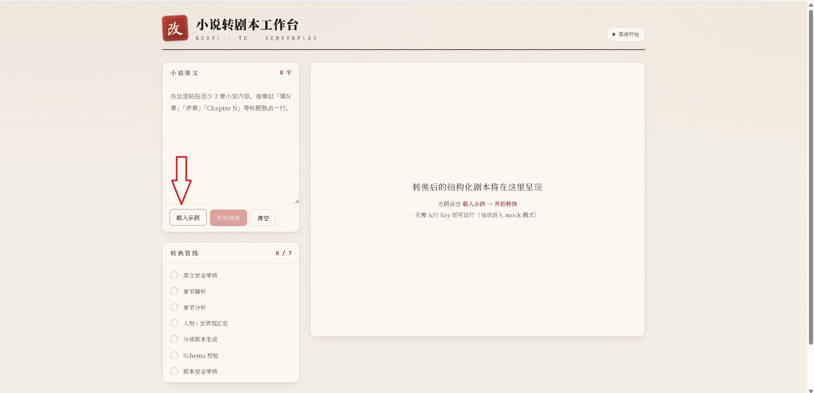
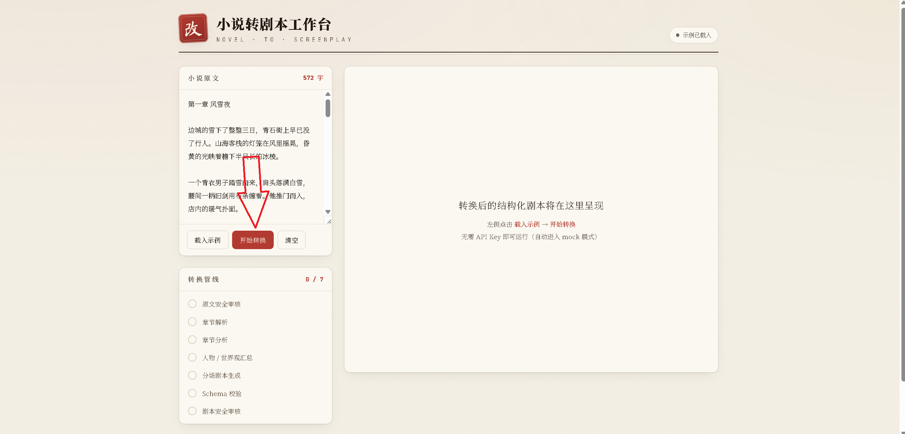

# AI Novel-to-Screenplay Converter

Convert multi-chapter novels into **structured, verifiable, and editable** YAML screenplay drafts quickly.

- **Input**: Novel text with 3+ chapters (paste or load sample)
- **Output**: Valid YAML screenplay (characters / locations / timeline / scenes / dialogue / action / narration / transitions / adaptation notes / open questions)
- **Five-step stable pipeline** with chapter-by-chapter processing — no full-text stuffing into the model at once
- **No API Key required**: Automatically enters mock mode, extracting real information from your input to generate sample screenplays
- Built-in JSON Schema validation (ajv), one-click verification of output validity

---

## Quick Start

```bash
# 1. Install dependencies
npm install

# 2. (Optional) Configure AI. If skipped, auto mock mode is used
cp .env.example .env
#   Fill in OPENAI_API_KEY in .env to enable real AI conversion

# 3. Start development server
npm run dev
#   Open http://localhost:3000
```
first coming:

Once opened: click "**Load Sample**" on the left → 


click "**Start Conversion**" → the YAML screenplay appears on the right, ready to copy / download / validate.


Or you can copy your own novel text, paste it into the input box, click "**Start Conversion**" → the YAML screenplay appears on the right, ready to copy / download / validate.

---

## Validation Without Starting the Server

```bash
# Run unit tests (chapter parsing, Schema validation, mock generation)
npm test

# Use standalone script to validate any YAML screenplay against the Schema
npm run validate                                          # Validate examples/sample-screenplay.yaml (should PASS)
node scripts/validate.mjs examples/valid-example.yaml     # PASS
node scripts/validate.mjs examples/invalid-example.yaml   # FAIL (with error details)
```

---

## How It Works (Five-Step Pipeline)

```
Novel Text
  │
  ① Chapter Parsing (deterministic, regex, unit-testable)      lib/chapters.ts
  │   └─ Identify titles / split chapters / preserve original text / extract summaries; error if fewer than 3 chapters
  ② Chapter-level Analysis (AI / mock)                          lib/ai.ts · lib/mock.ts
  ③ Character + Worldbuilding Summary (AI / mock)
  ④ Scene-by-scene Screenplay Generation (per-chapter, AI / mock)
  ⑤ Assembly → Schema Validation → Auto-fix                    lib/schema.ts · lib/pipeline.ts
  │
Valid YAML Screenplay (lib/yaml.ts serializes from validated objects, always valid)
```

**Key Design**: Each AI step returns JSON only; the backend assembles them into objects before serializing to YAML, so the output is inherently valid and parseable; YAML-fix / Schema-fix prompts are retained as fallbacks.

---

## Project Structure

```
aitransfer-script/
├── app/                          # Next.js App Router
│   ├── page.tsx                  # Three-column tool UI (input / progress / YAML preview)
│   ├── layout.tsx
│   ├── globals.css               # Design tokens and styles
│   └── api/
│       ├── convert/route.ts      # Streaming conversion API (NDJSON progressive updates)
│       ├── parse/route.ts        # Chapter parsing preview
│       ├── validate/route.ts     # YAML → Schema validation
│       └── sample/route.ts       # Return built-in sample novel
├── lib/                          # Core logic (framework-agnostic, testable directly)
│   ├── types.ts                  # Shared types
│   ├── chapters.ts               # ① Chapter parsing (deterministic)
│   ├── prompts.ts                # AI prompt templates (6 sets)
│   ├── ai.ts                     # OpenAI call + mock detection
│   ├── mock.ts                   # Mock mode: rule-based extraction and screenplay generation
│   ├── pipeline.ts               # Five-step pipeline orchestration (async event stream)
│   ├── schema.ts                 # ajv loading + validation
│   └── yaml.ts                   # YAML serialization / parsing
├── schema/
│   └── screenplay.schema.json    # Screenplay JSON Schema (draft-07)
├── docs/
│   └── screenplay-yaml-schema.md # Schema design doc (field descriptions + design rationale)
├── examples/
│   ├── sample-novel.txt          # Sample novel (3 chapters)
│   ├── sample-screenplay.yaml    # Converted screenplay example (validation passed)
│   ├── valid-example.yaml        # Minimal valid example
│   └── invalid-example.yaml      # Invalid example (with failure reason annotations)
├── scripts/
│   └── validate.mjs              # Standalone Schema validation CLI
├── tests/                        # vitest unit tests
│   ├── chapters.test.ts
│   ├── schema.test.ts
│   └── mock.test.ts
├── .env.example                  # Environment variable example (with AI Key)
└── README.md
```

---

## Environment Variables

See `.env.example`:

| Variable | Description |
|----------|-------------|
| `OPENAI_API_KEY` | OpenAI (or compatible protocol) Key. **Leave empty to auto-enable mock mode** |
| `OPENAI_BASE_URL` | Optional, custom gateway / Azure / domestic compatible service |
| `OPENAI_MODEL` | Model name, default `gpt-4o-mini` |
| `USE_MOCK` | Set to `1` to force mock mode (even if Key is configured), useful for demos / testing |

---

## AI Prompt Templates (`lib/prompts.ts`)

1. Chapter Analysis  2. Character Extraction  3. Worldbuilding Extraction  4. Scene Generation  5. YAML Fix  6. Schema Fix

Unified constraints: output valid JSON/YAML only, no Markdown wrappers, preserve original key information, do not invent major plot points, allow dramaturgical compression and rewriting, write uncertainties into `open_questions`.

---

## How to Extend Further

- **Integrate more models**: `lib/ai.ts` uses the OpenAI Chat Completions protocol; set `OPENAI_BASE_URL` to switch to domestic compatible gateways.
- **Switch formats (film / TV series / short drama / radio drama)**: Pass `format`, and switch `acts`/`episodes` organization layers per `docs/screenplay-yaml-schema.md` Section 6.
- **Finer scene breakdown**: Adjust the "how many scenes per chapter" strategy in the scene generation prompt in `lib/prompts.ts`.
- **Export to Fountain / PDF**: Based on `scenes[].elements` types (dialogue/action/narration/transition), map directly to standard screenplay formats.
- **Persistence and collaboration**: Currently a stateless tool; add save endpoints in `app/api` to connect to a database.

---

## Tech Stack

Next.js 14 (App Router) · TypeScript · ajv (JSON Schema validation) · yaml · openai · vitest
