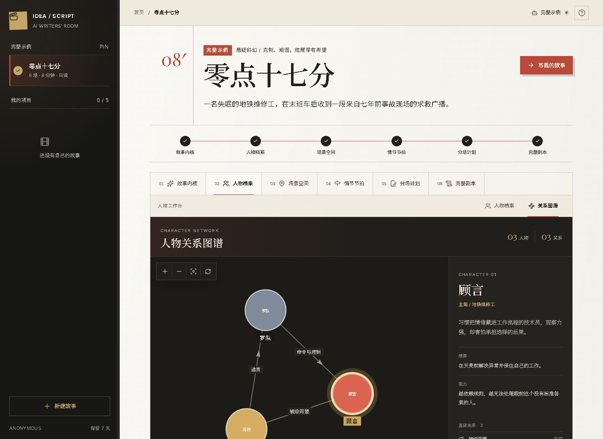
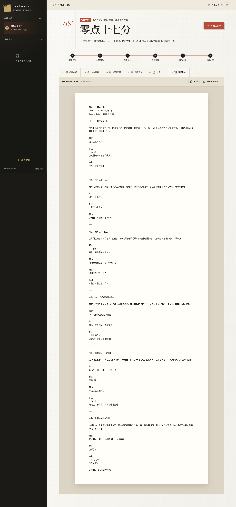

# Idea2Screenplay

一句创意，逐层发展为人物、世界、三幕节拍、分场和完整剧本的 AI 编剧工作台。

项目借鉴 [Dramatron](https://github.com/google-deepmind/dramatron) 的分层故事生成思想，使用现代 Web 技术重新实现：前端为 React，后端为 NestJS，数据持久化到 PostgreSQL。代码没有复制 Dramatron 实现。

## 产品截图

### 人物关系图谱



### 完整剧本预览



## 为什么不是“一次 Prompt 写完”

完整剧本直接生成容易出现人物动机漂移、场景重复和前后矛盾。本项目把创作拆成六个有依赖关系、可追踪的阶段：

```text
故事种子 → 前提/主题 → 人物 → 空间 → 三幕节拍 → 分场 → 动作与对白
```

每个阶段单独调用模型、验证结构化 JSON、写入暂存版本并通过 SSE 推送进度。用户可以审阅、编辑、保存或局部重生成当前阶段，明确确认后才会进入下一阶段；完整剧本最终确认前不会替换已有成功稿。

## 已实现功能

- 一句话创意建档，支持类型、气质、语言和目标时长
- 面向 100 人私测的访问码门禁，支持原创短剧与最多 10,000 字网文素材
- 社会热点选题台：持久化公开注意力快照，保留来源与风险状态，并转成脱敏的 AIScript 创作提示词
- 不依赖 API 与数据库的固定完整示例 `/workspace/sample`
- 六阶段层级式剧本生成，每阶段可编辑、保存、局部重生成并确认后继续
- OpenAI-compatible 模型接口，可连接 OpenAI、OpenRouter、Ollama 等兼容服务
- 无 API Key 演示模式，开箱即可跑完整流程
- PostgreSQL 持久化人物、地点、节拍、场景和生成记录
- 一人一码的私测准入、HttpOnly 签名身份与项目所有权隔离
- ALTCHA 工作量证明、访客/IP/全站额度、月度熔断和单并发保护
- PostgreSQL + pg-boss 持久化生成任务、有限重试和 Job 状态查询
- SSE 实时生成进度，断线后自动轮询恢复，刷新页面可重新连接活跃任务
- 匿名项目固定保留 7 天，过期后立即停止访问并由每日持久化任务自动清理
- 三幕结构看板与人物档案
- 逐场编辑与保存
- Fountain 标准文本汇编、复制与下载
- 响应式“编剧室”界面
- Docker 本地数据库与生产容器配置

## 技术栈

| 层 | 技术 |
|---|---|
| Web | React 19、TypeScript、Vite、Lucide |
| API | NestJS 11、RxJS、SSE、class-validator |
| Database | PostgreSQL 17、Prisma ORM |
| LLM | OpenAI-compatible Chat Completions、JSON structured output |
| Quality | Jest、Vitest、Testing Library、ESLint |
| Delivery | npm workspaces、Docker Compose、Caddy |

## 本地启动

要求：Node.js 22.12+、Docker。

Windows 可以直接双击根目录的 `start-dev.cmd`。脚本会检查运行环境、启动 Docker Desktop 和 PostgreSQL、创建缺失的 `.env`、安装依赖、执行数据库迁移，并在前后端就绪后打开浏览器；已有 `.env` 不会被覆盖。

也可以在终端中手动启动：

```bash
npm install
cp .env.example .env
docker compose up -d postgres
npm run db:generate
npm run db:migrate
npm run dev
```

PowerShell 可使用 `Copy-Item .env.example .env` 代替 `cp`。

打开：

- Web: <http://localhost:5173>
- API health: <http://localhost:3000/api/health>

`.env.example` 默认使用 `DEMO_MODE=true`；复制为 `.env` 后不会调用外部模型。

热点选题台默认只启用免费的 Wikimedia 中文站每日热门弱信号。可选官方来源包括百度千帆“百度热搜”、微博商业热搜榜、X API v2 地区趋势，以及 YouTube 热门音乐/电影/游戏发现源；没有对应凭证/批准开关时自动禁用。系统不抓平台网页，也不把 X Post、YouTube 描述/频道/评论、微博博文/账号/评论或原始热点标题发送给剧本模型。X 与 YouTube 因多语言和用途授权边界默认进入 REVIEW，只能监控和预览脱敏 Brief；微博还要求显式确认商业合同已经覆盖当前用途。旧百度 `trending_lists` 接口已经下架且未被使用。配置、成本和合规边界见 [`docs/TREND_MONITORING.md`](docs/TREND_MONITORING.md)。

需要在本机持续进行不限额测试时，可以在 `.env` 中设置 `LOCAL_UNLIMITED_MODE=true`。该模式仅跳过本地开发环境的项目数、局部重生成次数、挑战频率和访客/IP/全站生成额度；匿名所有权、ALTCHA 验证、持久化队列和生成并发保护仍然生效。生产环境检测到该开关会拒绝启动。

## 接入真实模型

编辑根目录 `.env`：

```dotenv
LLM_API_KEY=your-key
LLM_BASE_URL=https://api.openai.com/v1
LLM_MODEL=gpt-4.1-mini
DEMO_MODE=false
```

兼容服务需实现 `POST /chat/completions`。系统会先尝试 `response_format: { type: "json_object" }`；不支持时自动去掉该参数重试。

### PREMISE Agent 灰度模式

项目包含一个默认关闭的受控 AgentRuntime 纵向切片。只有确认模型供应商支持 OpenAI-compatible tool calls 后才应启用：

```dotenv
DEMO_MODE=false
GENERATION_RUNTIME=agent
AGENT_ENABLED_STAGES=PREMISE
AGENT_PREMISE_MAX_STEPS=4
AGENT_PREMISE_TOKEN_BUDGET=16000
AGENT_TIMEOUT_MS=90000
```

Agent 仅拥有 `validate_premise_draft` 和 `submit_premise_draft` 两个 Run-scoped 工具；没有 Bash、文件、MCP、Cron 或 Sub-Agent 权限。其他五个阶段继续使用原有 JSON 生成器。默认 `GENERATION_RUNTIME=legacy`。

## 固定公网 IP 生产部署

生产容器已改为 Node.js 24、Caddy、NestJS 与 PostgreSQL 17，通过一个固定公网 IP 提供服务。首次部署需要先以 HTTP bootstrap 模式启动，再使用 Certbot 5.4+ 签发短期 IP 地址证书并切换到 HTTPS。

完整命令见 [`docs/IP_DEPLOYMENT.md`](docs/IP_DEPLOYMENT.md)。架构与预算说明见 [`docs/PRODUCTION_ARCHITECTURE.md`](docs/PRODUCTION_ARCHITECTURE.md)。

生产 Compose 强制开启访问码门禁。部署前运行 `npm run access-codes:generate -- 100`，把输出写入服务器 `.env.production`，并为每位私测用户单独分发一个码；详细行为与额度见 [`docs/P1-ACCESS-QUOTA-CONTROL.md`](docs/P1-ACCESS-QUOTA-CONTROL.md)。生产环境文件只用于 Compose 运行时注入，构建上下文隔离与旧缓存处置见 [`docs/P1-DOCKER-BUILD-SECRET-ISOLATION.md`](docs/P1-DOCKER-BUILD-SECRET-ISOLATION.md)。

## 常用命令

```bash
npm run build       # 前后端生产构建
npm run test        # Jest + Vitest
npm run lint        # ESLint
npm run access-codes:generate -- 100  # 生成 100 个生产访问码
npm run db:migrate:dev -- --name your_change  # 开发新迁移
npm run db:studio   # Prisma Studio
```

## 目录

```text
apps/
  api/              NestJS API、Prisma schema、生成流水线
  web/              React 编剧工作台
docs/
  ARCHITECTURE.md   领域模型与生成协议
  UX_BLUEPRINT.md   已确认的信息架构与低保真交互
  PRODUCTION_ARCHITECTURE.md  生产架构与成本边界
  IP_DEPLOYMENT.md  无域名、固定公网 IP 上线手册
  TREND_MONITORING.md  外部热点来源、监听配置与 AIScript 安全转译
```

## 重要说明

AI 输出应被视为供人类编剧编辑的草稿。匿名身份、项目隔离、生成限额、Token 成本上限，以及热点输入的风险分级与生成前复核已由服务端强制执行；正式上线前仍应补充针对模型输出的真人实体、原热点措辞重合和高风险内容扫描。
