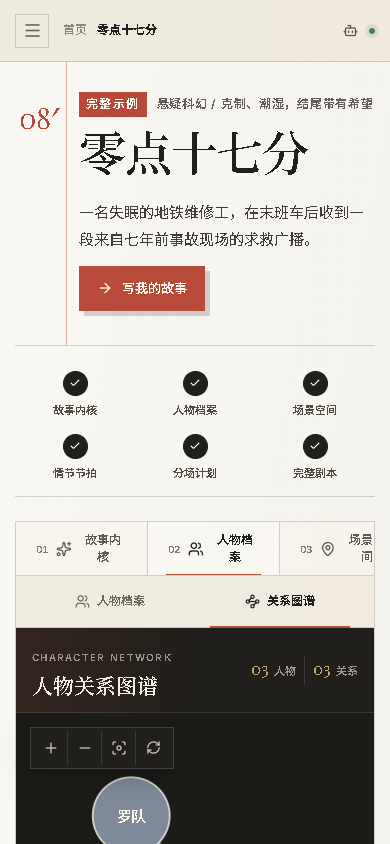
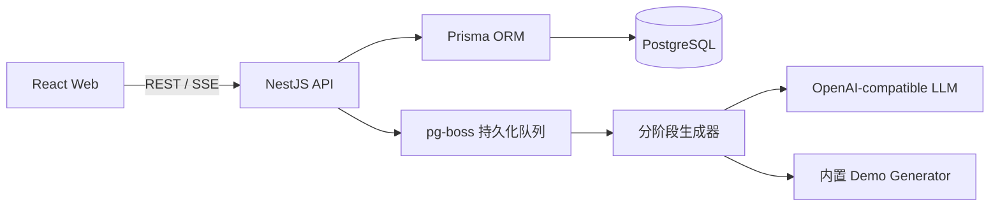

# Idea2Screenplay

> 一句话创意，逐层发展为人物、世界、三幕节拍、分场和完整剧本的 AI 编剧工作台。

Idea2Screenplay 是面向编剧和内容创作者的全流程 AI 剧本创作工具。它把故事拆成可审阅、可编辑、可回退的阶段，让 AI 负责发散，人类保留创作决策权。


## 项目概览

```text
故事内核 → 人物档案 → 场景空间 → 情节节拍 → 分场计划 → 完整剧本
```

每个阶段生成结构化草稿，并通过 SSE 推送进度。用户可以审阅、编辑、保存、局部重生成和确认；确认当前阶段后，系统才会继续下一阶段。

## 核心能力

- 一句话创意建档：类型、气质、语言、目标时长和原创/改编模式
- 六阶段剧本生成：故事内核、人物、空间、节拍、分场、完整剧本
- 人物档案与人物关系图谱，支持桌面端和移动端
- 社会热点选题台：将公开热点转译为脱敏创作 Brief
- 支持原创短剧和最多 10,000 字网文素材
- 每阶段可编辑、保存、局部重生成并确认后继续
- OpenAI-compatible 模型接口，可接入 OpenAI、OpenRouter、Ollama
- 内置 Demo 模式，无 API Key 也能完整体验
- PostgreSQL 持久化项目、人物、地点、节拍、场景和生成记录
- SSE 实时进度、断线轮询恢复、Fountain 文本复制与下载
- 账号密码认证、服务端会话、项目隔离、生成额度控制
- Docker Compose 本地开发及生产部署方案

## 产品截图

### 完整剧本与 Fountain 导出


### 人物关系图谱


### 响应式移动端界面



## 技术栈

| 层级 | 技术 |
| --- | --- |
| 前端 | React 19、TypeScript、Vite、Lucide |
| API | NestJS 11、RxJS、REST、SSE、class-validator |
| 数据库 | PostgreSQL 17、Prisma ORM、pg-boss |
| AI | OpenAI-compatible Chat Completions、JSON structured output |
| 工程质量 | Jest、Vitest、Testing Library、ESLint |
| 交付 | npm workspaces、Docker Compose、Caddy |

## 项目结构

```text
apps/
├── web/       React 编剧工作台
├── api/       NestJS API、Prisma Schema、生成流水线
└── agent/     受控 Agent Runtime 与剧本生成能力
docs/          架构、部署、安全和产品设计文档
artifacts/     README 展示截图
scripts/       PostgreSQL 备份、恢复与验收脚本
```

## 快速开始

环境要求：Node.js `22.12+`、Docker Desktop / Docker Engine、npm。

### Windows 一键启动

在项目根目录双击 `start-dev.cmd`。脚本会检查环境、启动 PostgreSQL、创建 `.env`、安装依赖、执行 Prisma 迁移并启动前后端。

### 手动启动

```bash
npm install
cp .env.example .env
docker compose up -d postgres
npm run db:generate
npm run db:migrate
npm run dev
```

PowerShell 可使用 `Copy-Item .env.example .env`。启动后访问：

- Web：<http://localhost:5173>
- API 健康检查：<http://localhost:3000/api/health>
- 固定完整示例：<http://localhost:5173/workspace/sample>

默认 `.env.example` 使用 `DEMO_MODE=true`，不会调用外部模型或产生模型费用。

## 接入真实模型

编辑根目录 `.env`：

```dotenv
LLM_API_KEY=your-key
LLM_BASE_URL=https://api.openai.com/v1
LLM_MODEL=gpt-4.1-mini
DEMO_MODE=false
```

兼容服务需要提供 `POST /chat/completions`。项目会优先请求 JSON structured output；不支持时自动降级重试。真实模型调用会产生服务商费用，请同时设置预算和限额。

## 生产部署

项目提供 Docker Compose + Caddy 生产配置，适合带固定公网 IPv4 的 Linux 云服务器。

```bash
cp .env.example .env.production
```

编辑 `.env.production`，至少配置：

```dotenv
NODE_ENV=production
PUBLIC_IP=你的公网IPv4
POSTGRES_PASSWORD=强密码
COOKIE_SIGNING_KEY=随机长字符串
VISITOR_IDENTITY_KEY=随机长字符串
IP_HASH_KEY=随机长字符串
ALTCHA_HMAC_KEY=随机长字符串
AUTH_THROTTLE_KEY=随机长字符串
DEMO_MODE=true
```

可用 `openssl rand -hex 32` 生成密钥。`.env.production` 只用于服务器运行时注入，禁止提交到 Git/Gitee。

首次部署：安装 Docker → 开放 80/443 → 使用 bootstrap 配置启动 → 用 Certbot 签发 HTTPS → 切换正式 HTTPS 配置 → 验证健康检查和登录流程。

正式启动：

```bash
docker compose --env-file .env.production -f docker-compose.prod.yml up -d --build
docker compose --env-file .env.production -f docker-compose.prod.yml ps
docker compose --env-file .env.production -f docker-compose.prod.yml logs --tail=100 api web
```

详细文档：[`docs/ALIYUN_DEPLOYMENT.md`](docs/ALIYUN_DEPLOYMENT.md)、[`docs/IP_DEPLOYMENT.md`](docs/IP_DEPLOYMENT.md)、[`docs/P2-DATABASE-BACKUP-RESTORE.md`](docs/P2-DATABASE-BACKUP-RESTORE.md)。

## 常用命令

```bash
npm run dev          # 启动 API 与 Web
npm run build        # 构建 Agent、API 和 Web
npm run test         # 执行全部测试
npm run lint         # 执行 ESLint
npm run db:generate  # 生成 Prisma Client
npm run db:migrate   # 执行数据库迁移
npm run db:studio    # 打开 Prisma Studio
```

## 架构简图



详细领域模型请查看 [`docs/ARCHITECTURE.md`](docs/ARCHITECTURE.md)。

## 设计原则

- AI 生成的是可编辑草稿，而不是不可追溯的最终答案。
- 每一阶段都可观察、可修改、可重试，确认后才向下游传播。
- 生成任务持久化，SSE 断线后可以轮询恢复。
- 默认 Demo 模式优先保证低成本、可复现的产品演示。

## 重要说明

AI 输出应被视为供人类编剧编辑的草稿。正式上线前，建议补充真人实体、热点原文重合、高风险内容和版权风险扫描，并在模型服务商侧配置独立费用上限。

## License

本项目采用 [MIT License](LICENSE)。
