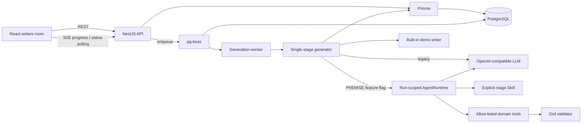

# Architecture

## 请求与数据流



`GenerationJobsService` 负责逐阶段任务、确认衔接、持久化事件和 Worker 状态，`GenerationQueueService` 负责 pg-boss。`GenerationService` 每次只执行一个阶段，并管理暂存版本编辑与最终激活。默认 legacy 路径仍由 `LlmService` 负责一次性 JSON 生成；PREMISE 可灰度切换到独立的 `apps/agent` workspace。API 适配器只提供限定项目和版本的结构化 Memory 快照与 Capability，Agent 以每次 Run 独立的工具白名单、显式 Skill、校验和受控提交完成阶段。Agent 返回的草稿仍由原有 Serializable 事务提交，不直接操作 Prisma。

Agent 模式默认关闭。它不注册通用 Bash、文件、MCP、Cron、外部 API 或 Sub-Agent 工具，不使用本地 Session/Memory，也不替代 pg-boss、GenerationVersion 或人工确认工作流。

## 生成阶段

| 阶段 | 输入 | 结构化输出 | 数据表 |
|---|---|---|---|
| PREMISE | 标题、logline、类型、气质 | premise、synopsis、theme | GenerationVersion |
| CHARACTERS | 已确认 premise | 人物目标、冲突、弧光、语言风格 | GenerationVersion |
| LOCATIONS | 已确认 synopsis、人物 | 地点、氛围、视觉母题 | GenerationVersion |
| BEATS | 已确认 synopsis、人物、地点 | 三幕节拍与情绪变化 | GenerationVersion |
| SCENES | 已确认节拍、地点、目标时长 | 场景标题、摘要、时长 | GenerationVersion |
| SCRIPT | 已确认人物与分场计划 | 动作、对白、括号提示 | GenerationVersion |

每个阶段对应一个 `GenerationJob` 和一条绑定 `GenerationVersion` 的 `GenerationRun`，包含状态、模型、错误和时间。生成结果只写 `STAGING` 版本并等待用户编辑/确认；确认前一阶段后才创建下一阶段 Job。最终 `SCRIPT` 确认时，系统在一个 `Serializable` 事务中重建 `Project`、`Character`、`Location`、`Beat`、`Scene` 查询投影并切换 `activeVersionId`。失败或重试不会覆盖已有成功稿。

## API

| 方法 | 路径 | 说明 |
|---|---|---|
| GET | `/api/health`、`/api/health/live` | 不访问数据库的进程存活状态 |
| GET | `/api/health/ready` | PostgreSQL 与 pg-boss 生成队列就绪状态；不创建访客 |
| GET | `/api/access/session` | 查询私测门禁状态；不创建访客 |
| POST | `/api/access/authorize` | 校验访问码并签发身份 Cookie |
| GET | `/api/projects` | 项目摘要列表 |
| POST | `/api/projects` | 创建故事种子 |
| GET | `/api/projects/:id` | 获取完整创作档案 |
| PATCH | `/api/projects/:id` | 更新项目设置 |
| DELETE | `/api/projects/:id` | 删除项目及关联数据 |
| GET | `/api/projects/:id/generate/challenge` | 获取绑定项目和访客的 ALTCHA 挑战 |
| POST | `/api/projects/:id/generate/authorize` | 验证工作量证明并签发一次性票据 |
| POST | `/api/projects/:id/generate/jobs` | 消费票据并创建持久化任务，返回 Job ID |
| POST | `/api/projects/:id/stages/:stage/generate` | 局部重生成当前未确认阶段 |
| PATCH | `/api/projects/:id/stages/:stage` | 保存当前阶段人工修改 |
| POST | `/api/projects/:id/stages/:stage/confirm` | 确认当前阶段并创建下一阶段 Job；最终阶段执行激活 |
| GET | `/api/projects/:id/generate/job` | 查询项目当前活跃任务，供刷新恢复 |
| GET | `/api/jobs/:jobId` | 查询持久化任务状态 |
| GET (SSE) | `/api/jobs/:jobId/events` | 按序回放和推送任务进度 |
| PATCH | `/api/projects/:projectId/scenes/:sceneId` | 保存分场修改 |

## SSE 事件

```json
{
  "type": "stage:complete",
  "stage": "CHARACTERS",
  "message": "塑造人物目标、矛盾与声音 · 完成",
  "progress": 31,
  "projectId": "uuid"
}
```

事件类型：`job:queued`、`job:running`、`job:retrying`、`job:succeeded`、`pipeline:start`、`stage:start`、`stage:complete`、`pipeline:complete`、`error`。事件保存于 `GenerationJobEvent`；SSE 只是通知通道，断开时前端使用 Job 状态轮询兜底。

## 匿名项目保留

项目创建时写入固定的 `expiresAt = createdAt + 7 days`，不会因访问、编辑或生成顺延。项目、场景、生成、Job 和所有权查询都要求 `expiresAt > now`；因此项目到期后立即不可访问。pg-boss 的 `expired-project-cleanup` 队列按 `0 3 * * *`、`Asia/Shanghai` 每天执行一次物理删除，关联版本、运行、业务 Job 和事件由数据库外键级联清理。清理任务还会删除超过 `VISITOR_RETENTION_DAYS` 且没有任何项目的孤儿访客；健康和准入路由不会创建访客，活跃访客的 `lastSeenAt` 默认每 5 分钟至多写一次。

## 下一阶段建议

1. 用 Zod 或 JSON Schema 对模型结果进行深层字段验证。
2. 按错误类型限制模型修复重试。
3. 引入角色状态与知识边界检查器，量化跨场景一致性。
4. 建立固定种子评测集，跟踪成功率、延迟、成本与一致性得分。
