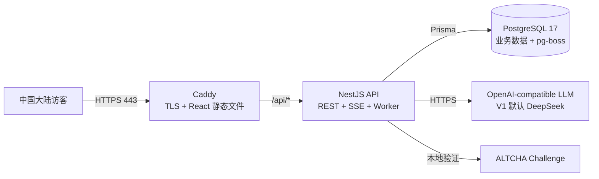
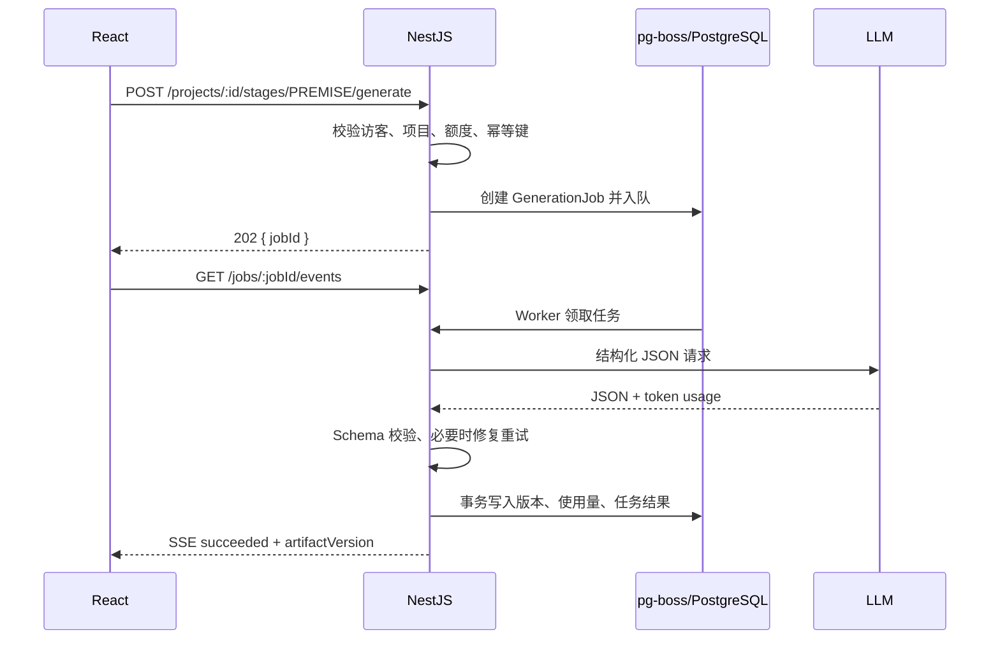

# Idea2Screenplay V1 生产架构与简易部署设计

> 状态：生产容器、P1/P2 代码与隔离验收已完成；目标 VPS、证书、cron 和供应商限额仍待运维实施  
> 最后更新：2026-08-15  
> 目标：主要供中国大陆面试官访问；V1 以最低成本展示真实产品闭环；V2 起固定基础设施预算尽量控制在人民币 200 元/年左右。  
> 本文件保留早期架构取舍，并同步当前部署边界；实际命令以 `IP_DEPLOYMENT.md`、`P1-INDEX.md` 和 `P2-INDEX.md` 为准。

## 1. 决策摘要

V1 采用一台香港轻量服务器承载全部服务，通过服务器的**固定公网 IP** 访问，不购买公网域名：

- **React** 构建静态页面。
- **Caddy** 提供 HTTPS、静态页面和 `/api` 反向代理。
- **Certbot 5.4+** 申请并自动续期 Let’s Encrypt 短期 IP 地址证书。
- **NestJS** 提供 REST、SSE、匿名身份、额度和生成任务处理。
- **PostgreSQL** 同时保存业务数据和持久化任务队列。
- **pg-boss** 作为 PostgreSQL 任务队列，不增加 Redis。
- **DeepSeek 的 OpenAI-compatible API** 作为 V1 默认真实模型，保留现有通用模型适配层。
- **ALTCHA** 自托管工作量证明挑战，配合匿名 Cookie、IP 段限额和全局熔断防刷。
- 固定完整示例不调用模型；每个匿名访客每天最多新建 1 个真实生成项目。

建议的部署顺序：

1. 面试临近且尚未购买服务器时，用 Sealos 7 天或 Zeabur 14 天试用临时上线。
2. 需要稳定展示时，购买带固定公网 IPv4 的腾讯云国际站香港 Lighthouse；优先选择当前符合资格的年度促销套餐。
3. 只有在确实需要中国大陆境内节点、完成备案且预算提高后，才迁移至大陆服务器。

## 2. 预算边界与部署选择

### 2.1 方案比较

| 方案 | 适用阶段 | 当前公开价格信号 | 大陆访问 | 备案 | 结论 |
|---|---|---:|---|---|---|
| 腾讯云国际站 Lighthouse，香港或邻近区域 | V1/V2 长期展示 | 官方页面当前列出部分 2C2G 套餐促销价 **10.08 美元/年**；资格、区域、续费价以下单页为准 | 通常可用，延迟高于大陆节点 | 香港/境外节点不要求 ICP 备案 | **主方案** |
| Sealos 公有云 | 紧急面试演示 | 7 天免费试用；Starter 新用户价 7 美元/月 | 可用性需在目标网络实测 | 取决于实际区域 | 仅临时使用，年费超预算 |
| Zeabur 托管运行时 | 紧急面试演示 | 14 天试用，之后 Developer 5 美元/月 | 可用性需在目标网络实测 | 取决于实际区域 | 仅临时使用，年费超预算 |
| 腾讯云大陆 Lighthouse | 正式大陆境内服务 | 国内 2C2G 常规套餐约 459 元/年 | 最稳定 | 需要域名 ICP 备案和接入备案 | 超出当前预算 |

价格来源：腾讯云 [Lighthouse 国际站](https://intl.cloud.tencent.com/zh/products/lighthouse) 与 [国内产品页](https://cloud.tencent.com/product/lighthouse)、[Sealos Pricing](https://sealos.io/pricing/)、[Zeabur Pricing](https://zeabur.com/en-US/pricing)。促销随时可能变化，购买前必须以结算页为准。

### 2.2 200 元/年的真实含义

人民币 200 元/年可以作为**固定基础设施目标**，但不能承诺覆盖无限量模型调用。

建议把成本拆成两本账：

| 成本 | 控制方式 |
|---|---|
| 服务器 | 仅在年度促销满足预算时购买；不用按月 PaaS |
| 域名 | V1 不购买，费用为 0；以后可无痛绑定域名 |
| HTTPS | Let’s Encrypt 免费 IP 地址证书；Certbot 自动续期，Caddy 加载证书 |
| 数据库与队列 | 与应用共用一台服务器，不购买托管数据库或 Redis |
| 模型调用 | 按量付费；设置每日项目上限、单阶段 Token 上限和月度熔断预算 |

V1 面试展示建议把全站真实生成上限设为每天 5–10 个项目。额度用尽后仍可完整浏览固定示例，从而确保任何时候都有可展示成果。

## 3. 为什么第一版不使用大陆服务器

腾讯云官方说明：网站使用中国大陆服务器时需要完成 ICP 备案；香港及境外服务器不要求备案，且不能用于办理备案。相关规则见 [是否需要备案](https://cloud.tencent.com/document/product/243/20220)、[香港及境外服务器说明](https://cloud.tencent.com/document/product/243/18908)。

因此，V1 使用香港节点可以缩短上线准备时间，也更接近当前预算。代价是部分地区与运营商的网络延迟可能高于大陆节点。购买前应使用目标运营商网络实测首页、SSE 长连接和模型生成过程。

## 4. 生产拓扑



服务器只公开 `80/443`。NestJS 的 `3000` 和 PostgreSQL 的 `5432` 只加入 Docker 内部网络，不映射到公网。

### 4.1 容器职责

| 容器 | 职责 | 建议资源上限 |
|---|---|---:|
| `web`（Caddy） | 自动 HTTPS、React SPA、静态资源缓存、API/SSE 反代 | 128 MB |
| `api`（NestJS） | API、SSE、Cookie、额度、队列生产者与单并发 Worker | 768 MB |
| `postgres` | 业务数据、版本、任务、额度、使用量 | 640 MB |

2 GB 内存主机保留约 400–500 MB 给系统和 Docker，并配置 1 GB swap 作为异常峰值保护。swap 不能代替内存，只用于降低突发 OOM 风险。

容器还必须遵守最小权限边界：API 以 UID 1000 运行，使用只读根文件系统、tmpfs `/tmp`、`no-new-privileges`、`cap_drop: ALL` 和 128 PID 上限；Web 采用只读根文件系统，只恢复 `NET_BIND_SERVICE`；四个生产服务的 Docker 日志均为 10 MiB × 3 轮转。PostgreSQL 为兼容 fresh volume 初始化不强制只读或清空 capabilities。实测证据与取舍见 [P2-CONTAINER-HARDENING.md](./P2-CONTAINER-HARDENING.md)。CPU 配额待目标 VPS 压测后决定。

### 4.2 为什么不增加 Redis

V1 流量很低，但生成请求持续时间长。直接在 HTTP 请求中跑完整模型调用，会在重启或断线时丢失状态；引入 Redis 又会增加一个需要维护和备份的服务。

[pg-boss](https://github.com/timgit/pg-boss) 使用 PostgreSQL 的 `SKIP LOCKED` 实现可靠队列，支持重试、定时任务和失败队列，适合当前单机低并发场景。V1 让 Worker 与 NestJS 同进程运行；未来横向扩容时再拆成独立 Worker 容器。

## 5. 一个网址的请求路径

正式地址示例：`https://43.xxx.xxx.xxx`

Let’s Encrypt 已于 2026 年开放 IPv4/IPv6 地址证书，IP 证书必须使用约 6 天有效期的短期证书，因此续期自动化是上线必需项。Certbot 5.4+ 可以通过 `--preferred-profile shortlived` 与 `--ip-address` 申请，当前只负责获取证书，Caddy 需要显式加载证书文件。参见 [IP 地址证书正式开放](https://letsencrypt.org/2026/01/15/6day-and-ip-general-availability.html) 与 [Certbot IP 证书说明](https://letsencrypt.org/2026/03/11/shorter-certs-certbot)。

| 路径 | 处理者 | 用途 |
|---|---|---|
| `/`、`/workspace/*` | Caddy | React SPA 与客户端路由回退 |
| `/assets/*` | Caddy | 带内容哈希的长期缓存静态资源 |
| `/api/*` | NestJS | 项目、阶段、额度、导出、健康检查 |
| `/api/jobs/:id/events` | NestJS SSE | 生成进度和结果通知；禁用代理缓冲 |

前后端同源后，生产环境不需要开放宽泛 CORS。开发环境仍允许 `http://localhost:5173`。公网 IP 必须固定；更换 IP 后，旧证书和分享链接都将失效，需要重新签发。

## 6. 匿名身份与每日额度

### 6.1 匿名身份

首次访问时由服务端生成 256-bit 随机标识，写入：

```text
Set-Cookie: ids_visitor=<opaque-token>; HttpOnly; Secure; SameSite=Lax; Path=/; Max-Age=...
```

- 数据库只保存令牌的 HMAC 哈希，不保存原始令牌。
- 不使用侵入式浏览器指纹。
- IP 只保存带每日轮换盐的网段哈希，例如 IPv4 `/24`、IPv6 `/56`，不保存完整地址。
- 清除 Cookie 后会获得新设备标识，因此 IP 段和全站上限只作为第二道成本护栏。

### 6.2 额度规则

V1 默认规则：

| 规则 | 建议值 |
|---|---:|
| 每个匿名访客每天可开始的真实项目 | 1 |
| 每个 IP 段每天可开始的真实项目 | 3 |
| 每个访客最多保留项目 | 5 |
| 项目保留时间 | 7 天 |
| 全站每天真实项目 | 5–10，可配置 |
| 同时执行的模型任务 | 1 |
| 单项目额外局部重生成 | 3 次 |

“每天 1 次”指**开始一个真实项目**，不是六个阶段分别扣六次。该项目的六个基础阶段在 7 天保留期内均可继续完成。局部重生成单独受项目级上限约束。

额度处理必须使用数据库事务：

1. 验证 ALTCHA。
2. 锁定或创建当天 `DailyQuota`。
3. 检查访客、IP 段和全站上限。
4. 创建项目并预留一次 `PROJECT_START` 权益。
5. 成功入队后提交事务。
6. 若首个模型任务因系统或供应商错误最终失败，自动归还当天权益；内容被安全策略拒绝时不自动归还。

## 7. 生成任务模型

### 7.1 分阶段任务

产品要求用户逐阶段确认，因此队列单位是“一个阶段”，不是一次生成完整剧本：



### 7.2 状态机

```text
QUEUED → RUNNING → SUCCEEDED
                ↘ RETRYING → RUNNING
                ↘ FAILED
                ↘ REJECTED
```

- 默认最多 2 次系统重试，指数退避并加入抖动。
- 用户点击重试时必须复用或生成明确的 `Idempotency-Key`，防止双击创建两个模型任务。
- Worker 重启后从 PostgreSQL 恢复未完成任务。
- SSE 只是通知通道，不是事实来源；断线后前端用 `GET /api/jobs/:id` 补状态。
- 任务结果和阶段版本在同一个数据库事务中提交，避免“页面显示成功但数据不存在”。

## 8. 模型接入与结构化输出

V1 默认使用 DeepSeek 的 OpenAI-compatible 接口，但 NestJS 只依赖统一的 `LlmProvider` 接口，保留替换供应商的能力。

DeepSeek 官方文档说明 JSON Output 使用 `response_format: { "type": "json_object" }`，Prompt 中需要明确包含 JSON 指令，并提醒极少数情况下可能返回空内容，见 [JSON Output 指南](https://api-docs.deepseek.com/guides/json_mode/)。因此每个阶段必须：

1. 使用独立的 JSON Schema/Zod Schema。
2. Prompt 明确要求只返回 JSON，并包含一个最小合法示例。
3. 对空内容、截断、无效 JSON 和 Schema 不匹配分别记录错误类型。
4. 只把 429、超时、5xx 和网络故障交给有限 Job 重试；401/403、其他 4xx、空内容和无效 JSON 立即终止。只有供应商明确拒绝 `response_format` 时做一次兼容降级。
5. 保存模型、Prompt 版本、输入/输出 Token、耗时和估算成本。
6. 对用户原文和模型输出设置字符数、场景数和总 Token 上限。

建议生产默认值：

```text
LLM_TIMEOUT_MS=90000
GENERATION_CONCURRENCY=2
JOB_RETRY_LIMIT=2
GLOBAL_GENERATIONS_PER_DAY=100
GLOBAL_GENERATIONS_PER_MONTH=3000
VISITOR_GENERATIONS_PER_DAY=3
IP_GENERATIONS_PER_DAY=100
PROJECT_REGENERATIONS_MAX=3
```

## 9. 数据模型调整

现有 `Project`、`Character`、`Location`、`Beat`、`Scene` 和 `GenerationRun` 可以保留，但需要从“覆盖当前结果”演进为“匿名归属 + 可追踪版本”。

### 9.1 新增核心实体

```text
AnonymousVisitor
- id
- tokenHash (unique)
- createdAt / lastSeenAt

DailyQuota
- id
- date
- visitorId
- ipBucketHash
- projectStarts
- regenerationCount
- unique(date, visitorId)

Project
- visitorId
- mode: ORIGINAL | ADAPTATION
- sourceText
- isSample
- expiresAt
- activeVersionId

StageArtifact
- id
- projectId
- stage
- version
- parentArtifactId
- promptVersion
- contentJson
- createdAt
- unique(projectId, stage, version)

GenerationJob
- id
- projectId
- stage
- status
- idempotencyKey
- retryCount
- errorCode / safeErrorMessage
- artifactId
- queuedAt / startedAt / completedAt
- unique(projectId, idempotencyKey)

UsageEvent
- id
- generationJobId
- provider / model
- promptTokens / completionTokens
- estimatedCost
- durationMs
- createdAt
```

`StageArtifact` 使用不可变快照；用户编辑产生新版本，而不是直接抹掉生成结果。现有规范化的角色、地点、节拍和场景表继续作为当前版本的查询投影，以避免一次性重写现有编辑器。

### 9.2 清理策略

- 普通匿名项目创建时写入 `expiresAt = now + 7 days`。
- 每天凌晨由 pg-boss 定时删除过期项目及关联数据。
- 固定示例 `isSample=true`、`expiresAt=null`，不进入清理任务。
- 每日额度记录保留 30 天后聚合或删除。
- 错误日志不得写入完整 Prompt、Cookie、API Key 或完整 IP。

## 10. API 设计增量

```text
GET    /api/demo/sample
GET    /api/session
POST   /api/challenge
POST   /api/projects
GET    /api/projects
GET    /api/projects/:id
PATCH  /api/projects/:id
DELETE /api/projects/:id

POST   /api/projects/:id/stages/:stage/generate
PATCH  /api/projects/:id/stages/:stage
POST   /api/projects/:id/stages/:stage/confirm
POST   /api/projects/:id/artifacts/:artifactId/regenerate

GET    /api/jobs/:id
GET    /api/jobs/:id/events

GET    /api/projects/:id/export/fountain
GET    /api/projects/:id/export/text
GET    /api/health/live
GET    /api/health/ready
```

所有项目接口都从 HttpOnly Cookie 解析访客身份，永远不相信客户端传入的 `visitorId`。固定示例使用只读 DTO，不返回内部 Prompt 或模型元数据。

## 11. 防刷、安全和成本熔断

### 11.1 V1 必须具备

- ALTCHA 自托管挑战，开始真实项目之前验证；固定示例不验证。
- 表单蜜罐和最短填写时间，拦截最简单脚本。
- Cookie、IP 段、全站三级额度。
- 输入长度、字段白名单、严格 DTO 与 JSON Schema 校验。
- 全局并发 1，队列长度上限，超限返回可理解的稍后再试状态。
- 月度模型预算熔断；达到阈值后自动切到固定示例和演示生成器。
- API Key 只存在服务器环境变量，不进入 React bundle、日志和数据库。
- Caddy 自动 HTTPS；Cookie 必须设置 `Secure` 和 `HttpOnly`。
- PostgreSQL 不开放公网端口，使用随机高强度口令。
- 隐私说明、AI 草稿提示和内容举报邮箱/入口。

[ALTCHA](https://github.com/altcha-org/altcha) 可自托管、不依赖外部追踪，并以工作量证明替代图片验证码。它不是单独的机器人防火墙，因此仍需与数据库额度和全站熔断组合使用。腾讯云验证码国内免费试用只有 7 天，正式最小年包高于当前预算，V1 不采用。

### 11.2 V1 暂不做

- 登录、短信验证码、微信登录。
- 付费与订单。
- 多租户团队协作。
- 独立 Redis、Kafka 或 Kubernetes。
- 浏览器指纹与设备画像。
- 自动发布或分享公开剧本链接。
- 运行时后台管理系统；先用只读 SQL/脚本查看使用量。

## 12. 导出策略

2 GB 主机不建议为每次导出启动 Chromium。

- **复制纯文本**：前端直接生成。
- **Fountain**：复用现有汇编逻辑，服务端或客户端下载 UTF-8 文本。
- **PDF V1**：提供专用打印样式并调用浏览器“打印 / 保存为 PDF”。
- **PDF V2**：若必须一键下载，使用 PDFKit/pdfmake 与嵌入的中文字体；避免 Puppeteer。

## 13. 生产环境变量

```dotenv
NODE_ENV=production
PUBLIC_IP=<fixed-public-ipv4>
APP_URL=https://<fixed-public-ipv4>
API_PORT=3000
DATABASE_URL=postgresql://<user>:<strong-password>@postgres:5432/idea2screenplay?schema=public
COOKIE_SIGNING_KEY=<at-least-32-random-bytes>
COOKIE_SIGNING_KEY_PREVIOUS=
VISITOR_IDENTITY_KEY=<stable-different-random-secret>
IP_HASH_KEY=<different-random-secret>
ACCESS_CONTROL_REQUIRED=true
APP_ACCESS_CODES=<100-comma-separated-independent-codes>

LLM_PROVIDER=deepseek
LLM_BASE_URL=https://api.deepseek.com
LLM_API_KEY=<server-only-secret>
LLM_MODEL=<verified-model-name>
LLM_TIMEOUT_MS=90000

GENERATION_CONCURRENCY=2
JOB_RETRY_LIMIT=2
IP_PROJECTS_PER_DAY=200
GLOBAL_GENERATIONS_PER_DAY=100
GLOBAL_GENERATIONS_PER_MONTH=3000
VISITOR_GENERATIONS_PER_DAY=3
IP_GENERATIONS_PER_DAY=100
PROJECT_REGENERATIONS_MAX=3
VISITOR_RETENTION_DAYS=30

ALTCHA_HMAC_KEY=<different-random-secret>
DEMO_MODE=false
```

`.env` 不进入镜像和 Git。发布时使用服务器上的 root-only 环境文件，权限设为仅所有者可读。

## 14. 运行时与版本基线

当前根 `package.json` 声明 Node `>=22.12`，API/Web Dockerfile 已统一使用 **Node 24 LTS**；API runtime 只安装生产依赖并以非 root 用户运行。CI/开发机仍应使用相同大版本。参见 [Node.js Releases](https://nodejs.org/en/about/previous-releases)。

实施时同时固定：

- PostgreSQL 17 的具体小版本镜像或定期受控升级，不长期漂移使用未审计的 `latest`。
- Caddy 主版本与镜像摘要。
- Prisma migration 在启动 Worker 前只执行一次。
- 每次发布先备份数据库，再迁移，再滚动替换应用容器。

## 15. 备份、健康检查与可观测性

### 15.1 最小备份

- 已提供 fail-closed 的 `scripts/backup-postgres.sh`：每天执行一次 PostgreSQL custom-format `pg_dump`，原子发布 dump/manifest/SHA-256，root-only 保存并默认只保留最近 7 个完整集合。
- 每次发布必须先让备份脚本成功，再启动会执行 migration 的新 API；服务、数据库、稳定 manifest 或磁盘校验任一失败都停止发布。
- 已提供只允许 fresh 隔离目标的 `docker-compose.restore.yml`、`scripts/restore-postgres.sh` 和 `scripts/verify-postgres-restore.sh`；恢复会核对 migration、核心计数、外键、DB ready 和隔离 API ready，不能覆盖生产卷或非空数据库。
- 备份落到服务器独立目录；V2 再增加加密的低价对象存储异地副本，并按恢复点目标评估 WAL/PITR。
- 每月进行一次完整恢复演练，而不只是检查备份文件存在或 checksum。命令、安全门禁和 PostgreSQL 17 实测数据见 [P2-DATABASE-BACKUP-RESTORE.md](./P2-DATABASE-BACKUP-RESTORE.md)。
- 匿名项目只有 7 天生命周期，隐私说明应明确备份可能有短暂延迟删除。

### 15.2 健康检查

| 端点 | 检查内容 |
|---|---|
| `/api/health/live` | NestJS 事件循环仍可响应 |
| `/api/health/ready` | PostgreSQL 可访问、迁移版本正确、队列可用 |

模型供应商不可用时，API 本身仍应 `ready`，但 `/api/session` 返回“真实生成暂不可用”，固定示例继续工作。

### 15.3 日志

- 输出结构化 JSON：`requestId`、`visitorIdHashPrefix`、`projectId`、`jobId`、`stage`、耗时、错误码。
- 不记录完整创作素材和模型输出。
- API、Web、PostgreSQL 和 Certbot 的 Docker `json-file` 日志统一设置 10 MiB × 3 轮转，防止小磁盘被 stdout/stderr 填满。
- V1 不购买外部监控；先以 Docker healthcheck、磁盘告警脚本和供应商控制台告警为主。

## 16. Docker Compose 目标结构

```yaml
services:
  web:
    # React 多阶段构建 + Caddy runtime，加载 Certbot 签发的 IP 证书
    ports: ["80:80", "443:443"]
    depends_on: [api]
    volumes:
      - certbot_webroot:/var/www/certbot:ro
      - /etc/letsencrypt:/etc/letsencrypt:ro

  api:
    # Node 24 LTS，内部端口 3000，不映射公网
    depends_on:
      postgres:
        condition: service_healthy

  postgres:
    # PostgreSQL 17，随机口令，持久卷，不映射公网
    volumes:
      - postgres_data:/var/lib/postgresql/data

volumes:
  postgres_data:
  caddy_data:
  certbot_webroot:
```

生产 Compose 不再写死 `screenwriter/screenwriter`，不再使用 `WEB_ORIGIN=http://localhost:8080`，也不暴露数据库端口。

## 17. 实施分期

### Phase 0：无真实模型的受邀作品集

- 固定完整示例。
- 公网 HTTPS 与固定 IP 访问地址。
- 访问码门禁、`/api/health/live`、`/api/health/ready`、错误页和移动端基础检查；固定示例仍可直接查看。
- 不接 API Key，也不会产生模型成本。

**验收：** 面试官在手机和桌面浏览器打开链接，可完整查看六阶段成果和导出示例。

### Phase 1：V1 一次真实生成

- 匿名 Cookie、项目归属、7 天过期。
- ALTCHA 与三层额度。
- pg-boss、阶段任务、重试、SSE 断线恢复。
- DeepSeek 结构化输出与严格 Schema。
- 固定示例兜底、全站每日上限和月度预算熔断。

**验收：** 新访客能开始一个项目，逐阶段确认直到导出；刷新或 API 重启不丢任务；第二次创建被友好阻止。

### Phase 2：预算内长期维护

- 每日备份、日志轮转、磁盘告警。
- 提示词版本、成本报表、失败分类。
- 局部重生成额度与版本回退。
- 评估广告分镜模式的数据结构扩展。

**验收：** 30 天运行中无失控调用、无磁盘写满、无匿名越权；固定费用符合下单时预算。

### Phase 3：预算提高后的大陆正式化

- 购买大陆服务器并完成域名 ICP 备案及接入备案。
- 按实际公众服务范围复核内容安全、隐私与生成式 AI 合规要求。
- 增加登录、用户删除、异地备份、监控和更完整的内容治理。

## 18. 实施顺序

建议严格按下列顺序修改，避免同时重构 UI、数据和部署：

1. 把固定示例做成不依赖模型的只读数据。
2. 增加匿名访客、项目归属与 7 天清理。
3. 将现有同步生成拆成阶段队列任务，并补充状态查询。
4. 实现 SSE 重连与轮询兜底。
5. 增加 ALTCHA、额度事务和预算熔断。
6. 接入并验证 DeepSeek JSON Output。
7. 用 Caddy 替换生产 Nginx 入口，加入 HTTPS 和域名。
8. 完成备份、健康检查、日志轮转与部署清单。
9. 最后再按 `UX_BLUEPRINT.md` 重做公开首页和工作台视觉。

## 19. 上线检查清单

### 服务器

- [ ] 购买区域和公网流量包满足大陆访问实测。
- [ ] 防火墙只开放 SSH、80、443；SSH 使用密钥并禁止口令登录。
- [ ] PostgreSQL 与 API 无公网端口。
- [ ] 系统、Docker、时区、日志轮转和 swap 已配置。

### 域名与 HTTPS

- [ ] 公网 IPv4 为固定地址，不会随关机或重建实例释放。
- [ ] Certbot 5.4+ 成功签发短期 IP 地址证书。
- [ ] 系统定时器每天至少检查两次续期，并在续期后重载 Caddy。
- [ ] HTTP 自动跳转 HTTPS。
- [ ] SSE 经反向代理至少保持 2 分钟不断开。

### 应用

- [ ] 固定示例在模型断网时仍可用。
- [ ] 匿名项目无法跨 Cookie 读取。
- [ ] 清除 Cookie 后仍受 IP 段和全站成本上限保护。
- [ ] 双击生成只产生一个任务。
- [ ] API/Worker 重启后任务可以恢复。
- [ ] 过期项目按 7 天策略删除。
- [ ] 模型空响应、超时、限流和无效 JSON 都有可恢复提示。
- [ ] 达到每日或月度阈值后不再调用模型。

### 展示质量

- [ ] 中国移动、联通、电信至少各实测一次首页和生成链路。
- [ ] 微信内置浏览器、iOS Safari、Android Chrome/Edge 基本可用。
- [ ] 首页首屏在常见移动网络下快速出现，不依赖模型接口。
- [ ] 隐私说明、匿名保留期限、AI 草稿提示清晰可见。

## 20. 最终建议

第一版不要为了“正式”而立即承担大陆备案和 459 元以上年费。最合适的路线是：

> **先以固定示例保证作品集随时可看；随后部署到带固定公网 IP 的香港 Lighthouse 年付促销机，用 Certbot IP 证书 + Caddy + NestJS + PostgreSQL 单机部署，真实生成由 pg-boss 排队，并用匿名额度和全局预算熔断守住成本。**

这条路径能在不推翻 React、NestJS、PostgreSQL 现有实现的前提下，提供一个面试官可直接打开的 HTTPS IP 地址，也为 V2 广告分镜、后续绑定域名与将来大陆正式部署保留迁移空间。
